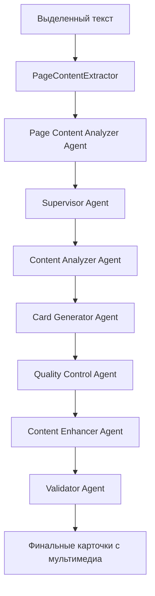

# 🎨 Улучшенный General Mode с поддержкой мультимедиа

## Обзор

Мы значительно улучшили создание карточек в General Mode, добавив интеллектуальную поддержку мультимедийного контента. Теперь система может автоматически анализировать страницу и включать в карточки:

- 🖼️ **Изображения** (диаграммы, схемы, иллюстрации)
- 📐 **Математические формулы** (LaTeX, MathML)
- 💻 **Блоки кода** (с подсветкой синтаксиса)
- 🔗 **Полезные ссылки** (образовательные ресурсы)

## Архитектура системы

### Новые компоненты

1. **PageContentExtractor** - Извлекает мультимедийный контент со страницы
2. **Page Content Analyzer Agent** - Анализирует релевантность контента для обучения
3. **Content Enhancer Agent** - Интегрирует мультимедиа в карточки

### Workflow AI агентов



## Технические детали

### PageContentExtractor

Интеллектуально извлекает контент страницы:

```typescript
// Основной метод
static extractPageContent(selectedText: string, selectionElement?: Element): PageContentContext

// Извлекает различные типы контента
private static extractImages(selectedText: string, selectionElement?: Element): PageImage[]
private static extractFormulas(selectedText: string, selectionElement?: Element): FormulaElement[]
private static extractCodeBlocks(selectedText: string, selectionElement?: Element): CodeBlock[]
```

### Алгоритмы оценки релевантности

#### Изображения

- Близость к выделенному тексту (500px радиус)
- Релевантность alt-текста
- Подходящий размер (200x150 - 1200x800)
- Исключение декоративных элементов

#### Формулы

- Обнаружение LaTeX: `$$formula$$`, `$formula$`
- Поддержка MathML: `<math>` элементы
- Анализ математических терминов в тексте
- Оценка сложности формулы

#### Код

- Блоки: `<pre><code>`, `.highlight`, `.code-block`
- Инлайн код: `<code>` (3-100 символов)
- Автоопределение языка программирования
- Анализ программистских терминов

### Page Content Analyzer Agent

Принимает решения о включении контента:

```typescript
interface ContentEnhancement {
  shouldIncludeImages: boolean;
  selectedImages: PageImage[];
  shouldIncludeFormulas: boolean;
  selectedFormulas: FormulaElement[];
  shouldIncludeCode: boolean;
  selectedCode: CodeBlock[];
  reasoning: string;
}
```

**Критерии отбора:**

- Диаграммы, схемы, иллюстрации концептов
- Математические выражения, связанные с текстом
- Примеры кода, алгоритмы из текста
- Образовательная ценность контента

### Content Enhancer Agent

Интегрирует мультимедиа в карточки:

**Форматы интеграции:**

- Изображения: `` в Markdown
- Формулы: `$$formula$$` в LaTeX
- Код: `language\ncode\n`

**Пример карточки с мультимедиа:**

````
Front: Что такое быстрая сортировка?

Back: Быстрая сортировка — это эффективный алгоритм сортировки...

```javascript
function quickSort(arr) {
    if (arr.length <= 1) return arr;
    // ... остальной код
}
````

Временная сложность: O(n log n)

```

## Использование

### 1. Включение режима
Переключитесь на "General Cards" в расширении

### 2. Выделение текста
Выделите текст на странице с мультимедийным контентом

### 3. Создание карточек
Нажмите "Создать карточки с AI" - система автоматически:
- Найдет релевантные изображения, формулы, код
- Оценит их образовательную ценность
- Интегрирует в карточки для лучшего запоминания

### 4. Предварительный просмотр
Проверьте созданные карточки с мультимедиа контентом

## Поддерживаемые форматы

### Изображения
- JPG, PNG, GIF, WebP
- SVG диаграммы
- Base64 изображения (до определенного размера)

### Математические формулы
- LaTeX: `$inline$`, `$$block$$`
- MathML: `<math>` элементы
- MathJax: `.math`, `.MathJax` классы

### Код
- **Языки:** JavaScript, Python, Java, C++, CSS, HTML, SQL, и др.
- **Форматы:** блочный код в `<pre>`, инлайн в `<code>`
- **Подсветка:** автоматическое определение языка

## Настройки качества

### Пороги релевантности
- Изображения: > 0.3
- Формулы: > 0.2
- Код: > 0.3
- Ссылки: > 0.2

### Ограничения
- Максимум 5 изображений
- Максимум 3 формулы
- Максимум 5 блоков кода
- Код: 10-2000 символов

## Примеры использования

### Научные статьи
```

Текст: "Фотосинтез происходит в хлоропластах..."

- Диаграмма процесса фотосинтеза
- Химические формулы реакций
  = Богатая образовательная карточка

```

### Программирование
```

Текст: "Алгоритм быстрой сортировки..."

- Схема алгоритма
- Пример кода
- Формула временной сложности
  = Комплексная карточка для изучения

```

### Математика
```

Текст: "Квадратное уравнение имеет вид..."

- Формула решения
- График функции
- Примеры решений
  = Полноценная математическая карточка

```

## Тестирование

Используйте `test-enhanced-general-mode.html` для тестирования:

1. Откройте тестовую страницу
2. Выделите любой пример текста
3. Создайте карточки через расширение
4. Проверьте интеграцию мультимедиа
5. Изучите логи в консоли

## Логирование

Система выводит подробные логи:

```

🚀 AI Agent Workflow: Starting intelligent card creation with multimedia support
📄 Extracted page content: {images: 2, formulas: 1, codeBlocks: 1}
🖼️ Step 0: Page content analysis
🧠 Step 1: Supervisor planning  
📊 Step 2: Content analysis
🎯 Step 3: Card generation
🔍 Step 4: Question quality check
🎨 Step 5: Content enhancement with multimedia
🔬 Step 6: Final validation
🎉 Workflow completed: 3 high-quality cards created

```

## Преимущества

1. **Повышение эффективности обучения** - мультимедиа карточки запоминаются лучше
2. **Автоматизация** - нет необходимости в ручном добавлении контента
3. **Интеллектуальность** - AI сам решает, что включать
4. **Качество** - многоуровневая система контроля качества
5. **Гибкость** - поддержка различных типов контента

## Техническая реализация

### Файлы
- `src/services/aiAgentService.ts` - Основная логика AI агентов
- `src/services/pageContentExtractor.ts` - Извлечение контента
- `src/components/CreateCard.tsx` - Интеграция в UI

### Зависимости
- Существующая AI инфраструктура
- Content scripts для доступа к DOM
- Система Redux для управления состоянием

Эта функциональность значительно повышает качество и эффективность создаваемых карточек, делая их более информативными и удобными для изучения!
```
